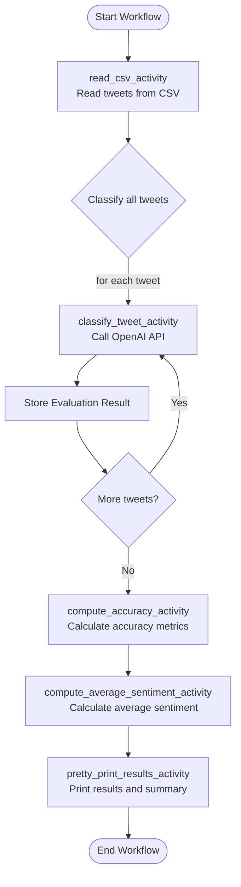

# Temporal Workflow Demo

## Goals

The goals for the following demo is as follows:

1. Given a dataset of Tweets (in `csv`) with the following columns (`tweet`, `airlines`, `sentiment`) and the OpenAI SDK compute the average sentiment for a given airline, along with the accuracy of the prediction. 
2. Accuracy is measured between 0 and 1 and represents the ratio of the AI prediction to the labeled value in the dataset. A value of 1 represents a perfect mapping between the predicted airline name and sentiment against the test data.
3. The sentiment is represented as a signed float value between -1 and 1. This value is the ratio of the average sentiment to the total number of Tweets for the given airline. A negative value represents a negative sentiment, 0 for netural and positive for a postive sentiment.
4. The given workflow is described as a flow chart below: 



## Setup

1. Create and activate a virtual environment `python -m venv venv/` and `source venv/bin/activate`
1. Install project dependencies `pip install -r requirements.txt`
1. Configure enviornment variables. Copy the `.env.example` to `.env` and set your OpenAI API key in the `.env` file.
1. Load the enviornment variable `source .env`
1. Start the temporal service `temporal server start-dev`
1. Start the worker `python run_worker.py`
1. Run the workflow `python run_workflow.py`

## Technical Details

The Temporal workflow consists of the following activities:
- `read_csv_activity`: Read and parse the input dataset using `pandas`
- `classify_tweet_activity`: Use the OpenAI API to extract the airline name and sentiment (Positive, Negative or Netural).
- `compute_accuracy_activity`: Compute the accuracy of the prediction as per the rules described above
- `compute_average_sentiment_activity`: Compute the average sentiment as per the rules described above. This activity returns a `Dict[str, float]` representing the average sentiment per unique airline
- `print_sentiment_scores_table_activity`: Prints the average sentiment as a table sorted by the sentiment score.

In addition to the activities we also provide a few non-retryable errors for any OpenAI API failures:
- `OpenAIError`: Raised when OpenAI API call fails or model doesn't return usable output
- `InvalidJSONResponse`: Raised when response from OpenAI is not valid JSON
- `MissingPrediction`: Raised if prediction fields are empty or nonsensical

Failures may also be simulated by restricting network access and the workflow is able to successfully recover from this state. We also limit the total number of retries to 3 along with a strict timeout of 20 seconds to prevent backpressure on upstream services.

### Challenges

1. The AI model can produce inconsistent outputs. To ensure consistent results, prompts must explicitly define the expected return format. In addition, a predefined list of normalized airline names is used to help the model return standardized values for accurate comparison.

2. Debugging workflows can be complex due to their distributed nature. While workflows running on a single worker are generally easier to reason about, distributed setups introduce new challenges—such as managing rate limits, handling timeouts, and ensuring consistent execution across nodes.

3. Temporal imposes size limits on workflow results. As a result, working with large datasets in `pandas` often requires writing data to disk or using external storage mechanisms, rather than returning large datasets directly.

4. Worker nodes may sometimes cache outdated versions of the application logic. In such cases, restarting the worker is necessary to ensure the latest code changes are picked up.

## Example Output

Sentiment Accuracy: 87.00%

Airline Name Accuracy: 80.00%

Sentiment Scores by Airline:

| Airline          | Sentiment Score |
|------------------|-----------------|
| Virgin America   |           0.00  |
| Delta            |          -0.10  |
| Southwest        |          -0.11  |
| US Airways       |          -0.44  |
| American         |          -0.72  |
| United           |          -0.82  |


Result:
```
{"airline_accuracy":0.8,"sentiment_accuracy":0.87}
```

## Potential Improvements

1. **Create a Management Dashboard**: Develop a simple web interface that integrates with Temporal’s API to monitor batch jobs, track costs, and visualize processing metrics.
1. **Implement Batching**: Instead of submitting each request to the API one at a time, create a queue system that builds batches of requests and use OpenAIs Batch endpoint for cost savings and efficiency
1. **Add Result Post-Processing**: Extend the workflow to include steps for processing and transforming batch results before storage or delivery to downstream systems.
1. **Build Webhook Notifications**: Implement a notification system that alerts services or users when batches complete processing.
1. **Optimize Polling Strategy**: Enhance the polling mechanism with exponential backoff and jitter to reduce unnecessary API calls while maintaining responsiveness.
1. **Add Database Integration**: Store results in a database with appropriate indexing for efficient retrieval and analysis. In addition, this can be used to circumvent any result size limitations with the Temporal server
1. **Implement Request Validation**: Add robust validation for incoming messages to prevent batch failures due to malformed requests.
1. **Performance Benchmarking**: Measure and optimize the performance of your batch processing system, potentially parallelizing certain operations for greater throughput.
