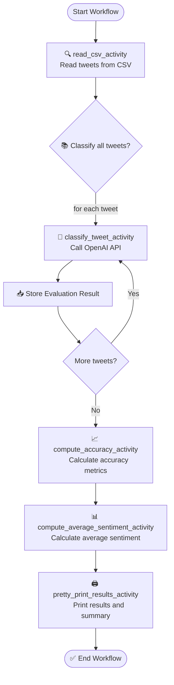

# Temporal Workflow Demo

## Goals

The goals for the following demo is as follows:

1. Given a dataset of Tweets (in `csv`) with the following columns (`tweet`, `airlines`, `sentiment`) and the OpenAI SDK compute the average sentiment for a given airline, along with the accuracy of the prediction. 
2. Accuracy is measured between 0 and 1 and represents the ratio of the AI prediction to the labeled value in the dataset. A value of 1 represents a perfect mapping between the predicted airline name and sentiment against the test data.
3. The sentiment is represented as a signed float value between -1 and 1. This value is the ratio of the average sentiment to the total number of Tweets for the given airline. A negative value represents a negative sentiment, 0 for netural and positive for a postive sentiment.
4. The given workflow is described as a flow chart below: 

## Technical Details

The Temporal workflow consists of the following activities:
- `read_csv_activity`: Read and parse the input dataset using `pandas`
- `classify_tweet_activity`: Use the OpenAI API to extract the airline name and sentiment (Positive, Negative or Netural).
- `compute_accuracy_activity`: Compute the accuracy of the prediction as per the rules described above
- `compute_average_sentiment_activity`: Compute the average sentiment as per the rules described above. This activity returns a `Dict[str, float]` representing the average sentiment per unique airline
- `print_sentiment_scores_table_activity`: Prints the average sentiment as a table sorted by the sentiment score.

In addition to the activities we also provide a few non-retryable errors for any OpenAI API failures:
- `OpenAIError`: Raised when OpenAI API call fails or model doesn't return usable output
- `InvalidJSONResponse`: Raised when response from OpenAI is not valid JSON
- `MissingPrediction`: Raised if prediction fields are empty or nonsensical

Failures may also be simulated by restricting network access and the workflow is able to successfully recover from this state. We also limit the total number of retries to 3 along with a strict timeout of 20 seconds to prevent backpressure on upstream services.

### Challenges
1. Data quality and consistency is paramount to ensure we're computing the accuracy values correctly. In order to ensure this, when extracting the airline names from the dataset we normalize these (convert to lowercase and parse as a string from its original `List[str]` type)
2. The AI model is subject to inconsistencies and in order to coerce the model the prompt must be specific in the return format required. We also provide a list of unique airline names to ensure that the model only returns a normalized value for comparison.
3. 

## Results

## Potential Improvements

1. **Create a Management Dashboard**: Develop a simple web interface that integrates with Temporal’s API to monitor batch jobs, track costs, and visualize processing metrics.
1. **Implement Batching**: Instead of submitting each request to the API one at a time, create a queue system that builds batches of requests and use OpenAIs Batch endpoint for cost savings and efficiency
1. **Add Result Post-Processing**: Extend the workflow to include steps for processing and transforming batch results before storage or delivery to downstream systems.
1. **Build Webhook Notifications**: Implement a notification system that alerts services or users when batches complete processing.
1. **Optimize Polling Strategy**: Enhance the polling mechanism with exponential backoff and jitter to reduce unnecessary API calls while maintaining responsiveness.
1. **Add Database Integration**: Store batch results in a database with appropriate indexing for efficient retrieval and analysis.
1. **Implement Request Validation**: Add robust validation for incoming messages to prevent batch failures due to malformed requests.
1. **Performance Benchmarking**: Measure and optimize the performance of your batch processing system, potentially parallelizing certain operations for greater throughput.
